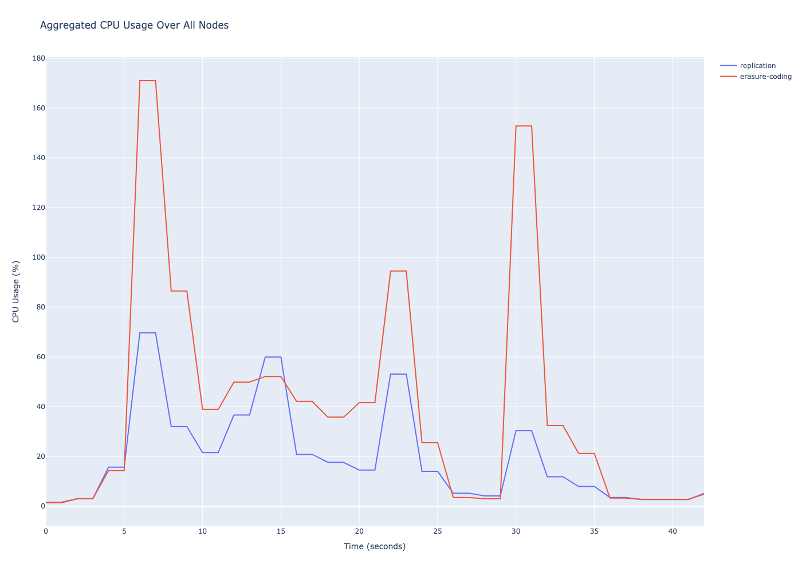

# Distributed File System
This project is an implementation of an assignment from a Distributed Systems course offered through CSU. I wanted to learn more about writing distributed applications and thought this could be a good place to start.

## A quick overview
The project is based around three types of nodes -- a node being a computer in a network executing a specific program. The three types of nodes are the *Controller*, the *ChunkServer*, and the *Client*.

The *Controller* communicates with both the *Client* and the *ChunkServers*. It keeps track of which files are being stored by which *ChunkServer*. It is also responsible for deciding, upon receiving from the *Client* a request to store a file, which *ChunkServers* are responsible for storing certain parts of the file (chunks). Additionally, it receives, at regular intervals, status updates from every *ChunkServer* called *heartbeats*. From information contained in each heartbeat, the *Controller* determines whether a *ChunkServer* is ready for storage, or if it has failed. If it determines that a *ChunkServer* has failed, it orchestrates the relocation of the lost chunks to another *ChunkServer*, if possible.

The *ChunkServer* is responsible for storing file chunks, sending heartbeat messages to the *Controller*, and serving data to the *Client*.

The *Client* is responsible for taking commands issued by the user, and translating those commands into procedures that store and retrieve files to and from the DFS. Storage and retrieval operations are complex, requiring coordinated communication between both the *Controller* and select *ChunkServers* in the overlay.

## Two techniques for fault-tolerance
This project uses two techniques for fault-tolerance, namely **erasure coding** and **replication**.

*Replication* splits every file the *Client* wishes to store into 64KB **chunks**. This project uses a redundancy factor of three by default, meaning that every chunk will be replicated on three *ChunkServers* at any given time. If a *ChunkServer* storing particular chunk goes offline, the *Controller* will notice, and during the next heartbeat will make an attempt to forward the chunks that used to be stored at that server to other available servers. In doing this, the *Controller* strives to maintain three copies of every chunk available on the DFS.

In addition to splitting every file into chunks, *erasure coding* further fragments each chunk into nine **shards**. Six of the nine are **data shards**, and three of the nine are **parity shards**. The data shards contain, as you might expect, one-sixth of the chunk's data. The parity shards contain, between the three of them, a linear algebraic representation of the data which is capable, when combined with other shards in a specific manner, of recovering missing or corrupt data shards. *Backblaze* has provided the code used in the project for encoding, decoding, and recovering shards using Reed-Solomon erasure coding. A high-level explanation of how it works can be found [here](https://www.backblaze.com/blog/reed-solomon/). Like with *replication*, when the DFS is using *erasure coding*, the *Controller* strives to keep all nine fragments resident on different servers. Of the nine fragments, any six can be used to recover the encoded data. Therefore, three servers can go offline while maintaining availability of a chunk.

Both *replication* and *erasure coding* schemas are additionally protected against data corruption using the SHA-1 hashing algorithm. For *replication*, every chunk is stored to disk with eight 20 byte SHA-1 hashes, each a hash of one-eighth of the chunk's data (an 8KB *slice*). During a read operation, all slices of the chunk are used to generate new hashes, which are then compared to the hashes stored on disk. If the slice hashes generated at write-time don't match the slice hashes generated at read-time, the chunk is not served and the *Controller* is notified. Upon being notified, the *Controller* will attempt to dispatch a repair message to other servers holding the same chunk, who will then forward their non-corrupted slices to the *ChunkServer* needing the repair.

All fragments (shards) written to disk under the *erasure coding* schema are also written with a hash of their data, and any read operation where the write-time hash doesn't match the read-time hash prompts the *ChunkServer* to notify the *Controller* of corruption.

## How to use it
I've been using macOS while developing this code, and have used SDKMAN! to install the necessary packages. *sdk current* tells me I'm using *Gradle 8.1.1* and *Java 17.0.8.1-tem*. I haven't tested how much leniency there is with respect to how up-to-date Gradle and Java must be to successfully compile the project, but having a newer version of Gradle is probably more important than Java. 

The *Controller's* ServerSocket binds to the host of the computer it is running on. Since both the *ChunkServer* and the *Client* are designed to communicate with the *Controller*, they must know how to contact the *Controller*. They use the *application.properties* file stored in the *config* folder of the project directory to find the *host* and *port* they should use to connect to the *Controller*. The file itself provides brief instructions for what to set *controllerHost* to based on how you're running the project. In short, if you're compiling and running the project on a single machine, using either the *osx.sh* or *ubuntu.sh* script, set *controllerHost* to *localhost*. If you're compiling and running the project using Docker, set *controllerHost* to *controller*. And, if you're compiling and running the project in a distributed environment, set *controllerHost* to the hostname of the computer the *Controller* will be running on. *controllerPort* is also configurable. Set *storageType* to *replication* if you'd like to use *replication*, and to *erasure* if you'd like to use *erasure coding* as your storage schema. Setting *logLevel* to *info* will print fewer log messages. The *debug* option was mostly meant to help with development.

The scripts *osx.sh* and *ubuntu.sh* each do the same thing, but the former is intended for macOS and the latter for Ubuntu. Each script compiles the project using Gradle, and starts the *Controller* node in the currently-open terminal window. Two new terminal windows are then spawned. Executing the command *./osx.sh c* (or *./ubuntu.sh c*) in one window will start the *Client*. Just executing *./osx.sh* (or *./ubuntu.sh*) in the other will start nine *ChunkServers*, each in a different tab of that terminal. The number of *ChunkServers* (nine) can be configured by modifying the script being used.

Commands can then be issued to each of the running nodes. The *Client*, by default, uses the *data* folder in the project directory as its working directory (which can be subsequently changed with the *wd* command). The *data* folder contains three test files -- *small.txt*, *medium.pdf*, and *large.jpg* -- which can, in a pinch, be used to test out the DFS. A command *put small.txt* should work right off the bat. You can then retrieve the file you just stored by issuing a *files* command, followed by a *get 0* command (which retrieves the zeroth file stored by the DFS).

Additionally, all nodes print usage instructions for their commands with the *help* command.

To use Docker instead of the scripts, change *controllerHost* in the *application.properties* file to *controller*, navigate to the *docker* directory in the project directory using your terminal, and, assuming Docker is already installed and running, use command *docker compose build* to first build the project, then *docker compose up -d* to run the project in detached mode. Then, to attach to any of the running containers, use *docker container attach <container_name>*. Detach from the the attached-to container using *CTRL-p-CTRL-q* (no dashes), which is the escape sequence. To shut down the Docker session, use *docker compose down*.

## Comparing Erasure Coding and Replication
To better understand the differences between the two storage schemas, I used a test script (located in the *docker* folder) to spin up two *docker-compose* sessions, one using the *replication* schema and the other *erasure coding*, for the purpose of peeling off statistics from both with the *docker stats* command. In each *compose* session, the *Client* stores and retrieves the three files located in the *data* folder. I then used a *python* script (also located in the *docker* folder) to aggregate the CPU, MEMORY, NETWORK, and DISK usage for all containers for each session. The same script then plots these aggregations against one-another using *plotly*.
### CPU Usage

Erasure coding is more cpu-intensive than replication. The command to store the files is issued at the five second mark during the test script, where the first spikes in cpu-usage appear. Under erasure coding, every chunk the *Client* stores must first be encoded into nine shards. The three test files -- *small.txt*, *medium.pdf*, and *large.jpg* -- are a combined 8.4MB in size. 8.4MB/64KB gives ~134 -- the total number chunks that need to be created to store those files. So, the calls to the *encode* function add up at scale to produce visibly larger spikes in cpu-usage over replication. The same number of calls to the *decode* function must to be made during download as well. The total number of threads needing to be spawned is increased under erasure coding too, as the encoded data must be relayed between all nine *ChunkServers* in the system -- and sending and receiving messages doesn't come free.
### Network Usage

Network activity is also greater for erasure coding than for replication. The activity shown in this plot is *cumulative* (not MB/s), so the height on the y-axis that the rightmost datapoint reaches represents the total network activity for all nodes for the duration of the test script. It should be noted that since *all* messages sent are successfully received, the y-coordinate is, in a sense, a double-count of the actual data transferred over the network. Under both replication and erasure coding, the *Client* sends a chunk to be stored by the DFS only to the *first* *ChunkServer* responsible for storing that chunk. It is then *that* *ChunkServer*'s responsibility to forward the chunk to the next *ChunkServer*. Under replication, the chunk is only sent over the network three times. But under erasure coding, shards are sent over the network nine times. Even when already-stored shards are shorn from the message before its being relayed, the total network transfer for storing a chunk using erasure coding is greater than for replication. Shards come to be ~11KB (64KB/6), but there are nine of them, so the total data transferred for one chunk during a storage operation comes to $\sum{k=1}^n a_k b_k
